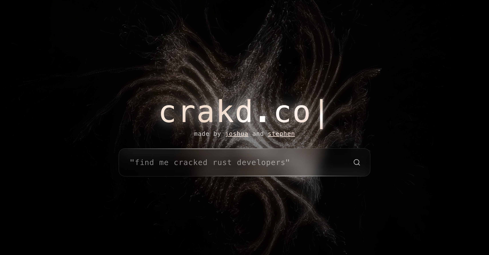

# crakd

ai-powered talent identification for developers.

crakd.co is a web application and local analysis tool designed to identify "cracked" (exceptionally talented) software developers. it leverages a hybrid ai model that combines quantitative github metrics with qualitative analysis from a large language model (gemini) to rank developers based on natural language queries.

## demo

<div align="center">
  
  <br><br>
  <a href="https://www.youtube.com/watch?v=xa1j3hpez9i&feature=youtu.be">
    
  </a>
</div>

## slideshow

<div align="center">
<a href="https://docs.google.com/presentation/d/1bphcg1xgjrs0n8qmzo2nz-ozx1lancffsviv0zrcyii/edit?usp=sharing">
  
</a>
</div>

## tech stack

- **frontend:** react, vite, framer motion
- **backend:** python, fastapi, docker
- **apis:** github graphql, google gemini

## architecture

<div align="center">
  
</div>

## getting started

### prerequisites

- node.js and npm
- python 3.8+ and pip
- docker

### installation & usage

#### frontend

1.  navigate to the `frontend` directory:
    ```bash
    cd frontend
    ```
2.  install dependencies:
    ```bash
    npm install
    ```
3.  start the development server:
    ```bash
    npm run dev
    ```

#### backend

1.  navigate to the `backend` directory:
    ```bash
    cd backend
    ```
2.  create a virtual environment and install dependencies:
    ```bash
    python -m venv .venv
    source .venv/bin/activate
    pip install -r requirements.txt
    ```
3.  create a `.env` file and add your api keys:
    ```
    github_token=your_github_token
    gemini_api_key=your_gemini_api_key
    ```
4.  run the fastapi server:
    ```bash
    uvicorn app.api:app --reload
    ```

#### local analysis tool (cli)

1.  navigate to the `backend` directory.
2.  run the cli tool with your query:
    ```bash
    python cli.py "your search query"
    ```

this will output the ranked list and generate a `pca_analysis.png` visualization.
