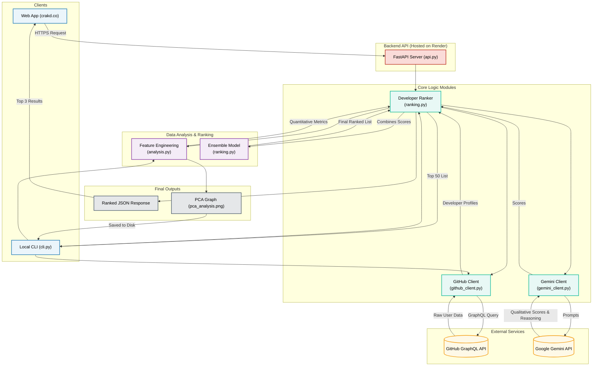

# Crakd Architecture (Detailed Presentation Diagram)

This is a more detailed, yet presentation-friendly, Mermaid.js diagram. It uses a top-down flow, color-coding, and includes key file names for context, while ensuring correct syntax.

